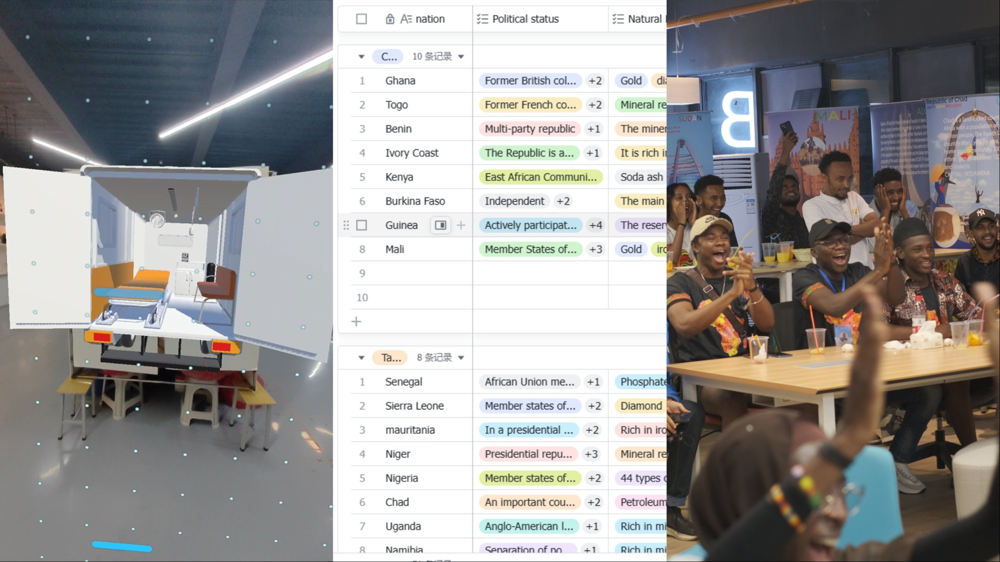
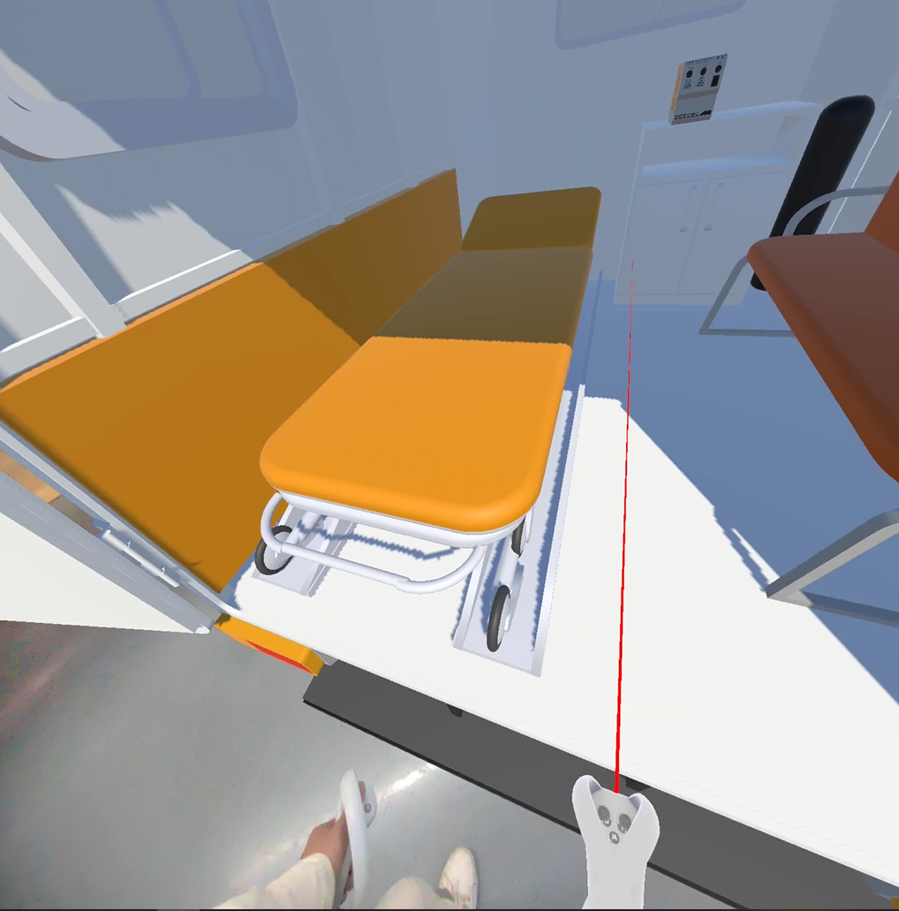
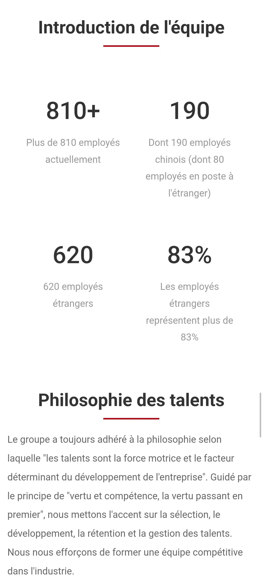
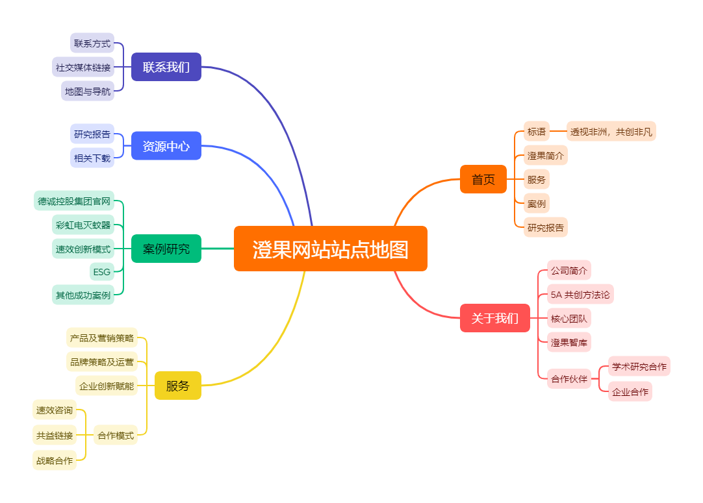
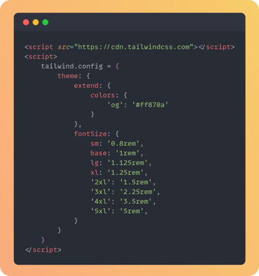
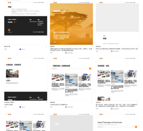
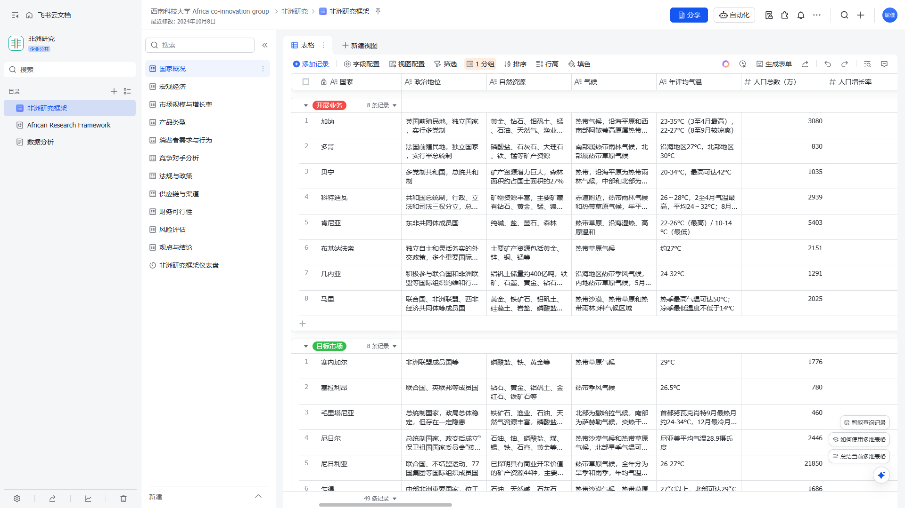
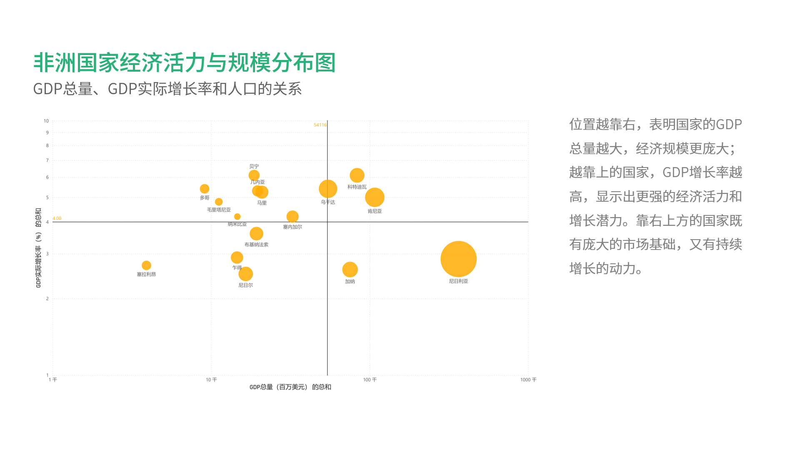
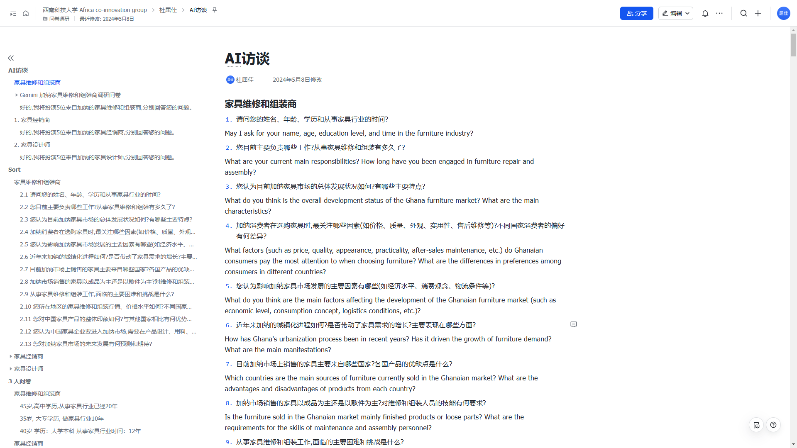
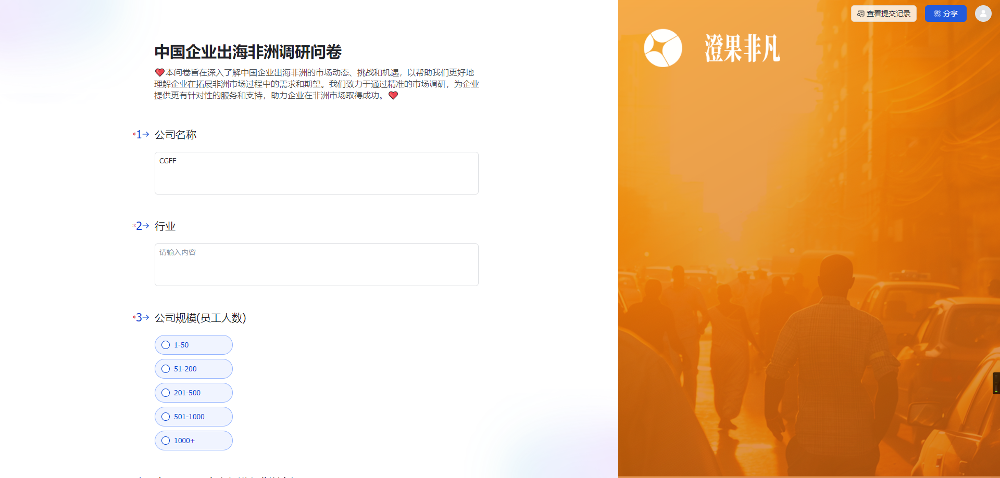

---
# You can also start simply with 'default'
theme: default
# random image from a curated Unsplash collection by Anthony
# like them? see https://unsplash.com/collections/94734566/slidev
# background: https://cover.sli.dev
# some information about your slides (markdown enabled)
title: 2024 工作汇报
info: |
  ## Slidev Starter Template
  Presentation slides for developers.

  Learn more at [Sli.dev](https://sli.dev)
# apply unocss classes to the current slide
class: text-left
# https://sli.dev/features/drawing
drawings:
  persist: false
# slide transition: https://sli.dev/guide/animations.html#slide-transitions
transition: slide-left
# enable MDC Syntax: https://sli.dev/features/mdc
mdc: true
---

# 2024 工作汇报

2025/2/27 杜屈佳

<div @click="$slidev.nav.next" class="mt-12 py-1 text-white" hover:bg="white op-10">
  Next page <carbon:arrow-right />
</div>

<div class="abs-br m-6 text-xl text-white">
  <button @click="$slidev.nav.openInEditor" title="Open in Editor" class="slidev-icon-btn ">
    <carbon:edit />
  </button>
  <a href="#" target="_blank" class="slidev-icon-btn">
    <carbon:logo-github />
  </a>
</div>

<div
  class="absolute inset-0 h-full w-full bg-black/10 bg-[linear-gradient(to_right,#80808012_1px,transparent_1px),linear-gradient(to_bottom,#80808012_1px,transparent_1px)] bg-[size:48px_48px] z-[-2]"
></div>
<BgGrid />

<style>
  h1, b,p{
  color: white;
}
</style>
<!--
The last comment block of each slide will be treated as slide notes. It will be visible and editable in Presenter Mode along with the slide. [Read more in the docs](https://sli.dev/guide/syntax.html#notes)
-->


---
transition: fade
---

<!--  -->


# 目录

&nbsp;


<div class="grid grid-cols-3 gap-8 abs-b px-12 pb-12">
  <div class='hover:bg-white/20 p-2 rounded-sm'>
    <b>VR 虚拟现实开发及网站建设</b>

医疗救护三轮车 VR 开发

德诚官网

澄果官网

  </div>

  <div class='hover:bg-white/20 p-2 rounded-sm'>
<b>非洲智库及分析研究</b>

非洲研究智库

数据可视化

加纳家具市场用户访谈 AI 访谈

  </div>

  <div class='hover:bg-white/20 p-2 rounded-sm'>
    <b>社媒运营</b>

非洲留学生活动

共创未来挑战营展会

APSONIC 电动三轮车拍摄

中国企业出海非洲调研

  </div>
</div>

<div
  class="absolute inset-0 h-full w-full bg-black/10 bg-[linear-gradient(to_right,#80808012_1px,transparent_1px),linear-gradient(to_bottom,#80808012_1px,transparent_1px)] bg-[size:48px_48px] z-[-2]"
></div>

<BgGrid />
<style>
  h1, b,p{
  color: white;
}
</style>
---
transition: slide-left
layout: quote
---

# VR 虚拟现实开发及网站建设
&nbsp;

- **医疗救护三轮车 VR 开发**

- **德诚官网**

- **澄果官网**

<div>
  <iframe class='absolute right-0 top-18  w-100 h-100' src='https://lottie.host/embed/0f7e63f1-ae8f-4b51-b43a-b0534b8fb4b9/PZtjpvNUz7.lottie'> </iframe>
</div>

---
transition: none
layout: image-right
image: images/VR01.png
---

# 医疗救护三轮车VR开发  

<div class='flex gap-4'> 
  <Tag v-for="(value,item,index) in {'C#':'bg-yellow-500','U3D':'bg-blue-600', 'PICO Integration SDK_250':'bg-purple-400',}"
  :value=value :item=item :index=index> </Tag>
</div>
 
在 `Unity 3D` 中配置 `PICO Integration SDK_250` 开发模块，采用 **C#** 开发医疗救护三轮车 VR 应用，实现了沉浸式交互体验。


---
transition: none
layout: image-right
image: images/website_en.png
---

# 德诚官网 — 英法适配

<div class='flex gap-4'> 
  <Tag v-for="(value,item,index) in {CSS:'bg-#22d3ee',Swiper:'bg-#60a5fa', Bootstrap:'bg-purple-400', Foundation:'bg-teal-800'}"
  :value=value :item=item :index=index> </Tag>
</div>

在德诚官网英法适配项目中，通过 **CSS** 和 **Swiper** 实现了视觉优化，利用 **Bootstrap** 和 **Foundation** 实现了多语言响应式布局和适配。


---
transition: none
layout: default
---

# 德诚官网 — SEO 优化 

<div class='flex gap-4'> 
  <Tag v-for="(value,item,index) in {Title:'bg-yellow-500','Meta':'bg-gray-600', SSL:'bg-green-500',' GTM':'bg-blue-400'}"
  :value=value :item=item :index=index> </Tag>
</div>

<br>
```html {all|7|8-9|10-14|all} twoslash
<!DOCTYPE html>
<html lang="zh">
  <head>
    <meta http-equiv="Content-Type" content="text/html; charset=UTF-8">
    <meta http-equiv="X-UA-Compatible" content="IE=edge">
    <meta name="viewport" content="width=device-width, initial-scale=1, maximum-scale=1">
    <title>Title</title>
    <meta name="description" content="description">
    <meta name="keywords" content="keywords">
    <meta name="applicable-device" content="pc,mobile">
    <meta property=“og:url” content="https://example.com" />     
    <meta property=“og:title” content="ogcontent" />                
    <meta property="og:description" content="ogdescription" />
    <meta property="og:image" content="ogimage.jpeg" />
  </head>
</html>
```

---
transition: slide-left
layout: image-right
image: /images/Ajax.png
---

# 德诚官网 — 功能开发 

<div class='flex gap-4'> 
  <Tag v-for="(value,item,index) in {AJAX:'bg-violet-500',SPA:'bg-blue-400', JavaScript:'bg-green-500'}"
  :value=value :item=item :index=index> 
  </Tag>
</div>

在德诚官网功能开发中，使用 <span v-mark.circle.orange="1">**AJAX**</span> 技术实现了数据动态加载，**SPA** 提升了页面交互性能，**JavaScript** 完善了前端逻辑处理。

```js {all|all|2|3-9|11|all} twoslash
// AJAX 请求示例
function loadMagazines() {
  const xhr = new XMLHttpRequest();
  xhr.open('GET', '/api/magazines');
  xhr.onload = () => {
    if (xhr.status === 200) {
      const data = JSON.parse(xhr.responseText);
      renderMagazines(data); // 动态更新页面
    }
  };
  xhr.send();
}
```
---
transition: none
layout: image-right
image: /images/benchmark.png
---

# 澄果官网 — 信息架构

<div class='flex gap-4'> 
  <Tag v-for="(value,item,index) in {标杆研究:'bg-#f56b1a', 站点地图:'bg-#e74c3c'}"
  :value=value :item=item :index=index> </Tag>
</div>

在澄果官网项目中，通过 **标杆研究** 分析行业领先案例，结合 **站点地图** 规划，实现了清晰高效的信息架构设计。



---
transition: slide-left
layout: image-right
image: /images/chengguo1.png
---

# 澄果官网 — 设计开发

<div class='flex gap-4'> 
  <Tag v-for="(value,item,index) in {域名注册:'bg-zinc-500', 服务器托管:'bg-#8b5cf6', 环境搭建:'bg-#1d4ed8' }"
  :value=value :item=item :index=index> </Tag>
</div>

在澄果官网设计开发中，通过 <span v-mark.orange="1">**域名注册**</span> 确保网站地址的权威性，利用 <span v-mark.orange="2">**服务器托管** </span>提供稳定运行环境，结合 **WordPress** 和 **GreenShift** 实现了高效的内容管理和动画页面构建。

<div class='grid grid-cols-2 gap-4'>

<div class='grid'>



</div>

<div>


</div>

</div>

---
transition: fade
layout: quote
---

# 非洲智库及分析研究
&nbsp;

- **非洲研究智库**

- **数据可视化**

- **加纳家具市场用户访谈 AI 访谈**

<div>
  <iframe class='absolute right-20 top-30  w-80 h-80' src='https://lottie.host/embed/f35bcb90-338e-465a-bd6d-397efdaab50b/ZFvxsdfZHI.lottie'> </iframe>
</div>

---
transition: none
layout: two-cols-header
---

# 非洲研究智库

<div class='flex gap-4'> 
  <Tag v-for="(value,item,index) in {知识库:'bg-#4ade80', 多维表格:'bg-#818cf8', 仪表盘:'bg-#67e8f9','Power BI':'bg-#fcd34d' }"
  :value=value :item=item :index=index> </Tag>
</div>

在非洲研究智库项目中，通过飞书 **知识库** 汇集非洲各国信息资料，再利用 **多维表格** 和 **仪表盘** 进行数据可视化，

结合 **Power BI** 实现了高效的数据分析与决策支持。

::left::

### 非洲研究框架

<!--  -->


::right::

### 数据可视化

<!--  -->


---
transition: slide-left
layout: two-cols-header
image: https://cover.sli.dev
---

# 加纳家具市场用户访谈 AI 访谈

<div class='flex gap-4'> 
  <Tag v-for="(value,item,index) in {Claude:'bg-#fdba74', Gemini:'bg-#a78bfa', PESTEL:'bg-#93c5fd' ,SWOT:'bg-#bef264'}"
  :value=value :item=item :index=index> </Tag>
</div>

在加纳家具市场用户访谈项目中，通过 **PESTEL** 和 **SWOT** 分析市场环境，利用 **Claude** 和 **Gemini** AI工具实现了高效访谈与数据分析。

::left::

### AI 访谈



::right::

### 访谈总结


---
transition: fade
layout: quote
---

# 社媒运营
&nbsp;

- **留学生迎新活动**

- **共创未来挑战营展会**

- **APSONIC 电动三轮车拍摄**

- **中国企业出海非洲调研**


<div>
  <iframe class='absolute right-20 top-30  w-80 h-80' src='https://lottie.host/embed/8534ba94-a540-4d37-b3d1-817b3d3075b3/1RtxJZqQzY.lottie'> </iframe>
</div>


---
transition: none
layout: image
image: /images/activities.jpg
---

<PhotoTitle>

# 非洲留学生活动
</PhotoTitle>

---
transition: none
layout: image
image: /images/challenge_camp.jpg
---

<PhotoTitle>

# 共创未来挑战营展会
</PhotoTitle>

---
transition: none
layout: image
image: images/tricycle.jpg
---

<PhotoTitle>

# APSONIC 电动三轮车拍摄
</PhotoTitle>

---
transition: none
layout: two-cols-header
image: https://cover.sli.dev
---

# 中国企业出海非洲调研


::left::

## 企业微信
<br/>


::right::

## 飞书问卷
<br/>


---
layout: end
image: https://cover.sli.dev
---

# END